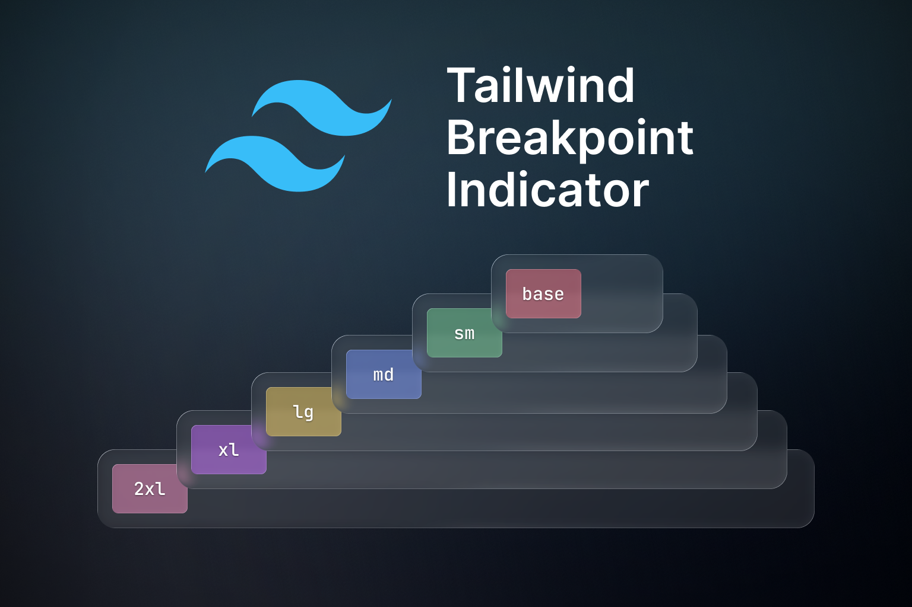

# Tailwind Breakpoint Indicator

Visual breakpoint indicator tool for Tailwind CSS development. Shows the current active breakpoint in the top-left corner of your browser during development.



## Features

- 🎨 Visual indicator with color-coded breakpoints
- 🔄 Automatically detects development mode
- ⏱️ Hide button with 20-second auto-show timer
- 🎯 Works with any build tool (Vite, Webpack, Rollup, etc.)
- 📦 Zero dependencies
- 🎛️ Configurable options

## Installation

```bash
npm install tailwind-breakpoint-indicator
```

## Usage

### Where to add the code

1. **Entry file** – Add the imports to your project’s main entry file (e.g. `src/main.ts`, `src/main.js`, or `src/index.js`). This is the file your bundler (Vite, Webpack, etc.) uses as the entry point.
2. **HTML** – On the page where the helper should run, add a script at the end of `<body>` that loads this entry file:

```html
<!-- At the end of <body> in index.html or your page -->
<script src="/src/main.ts" type="module"></script>
```

With Vite the path is often `/src/main.ts` or similar (e.g. `./src/main.ts`). The `src` attribute must point to your entry file that contains the imports.

### Basic Usage (Auto-initialize)

Import the package in your entry file; in development mode the helper will initialize automatically:

```javascript
// In your entry file (e.g. src/main.ts or src/main.js)
import 'tailwind-breakpoint-indicator/styles' // Import CSS
import 'tailwind-breakpoint-indicator' // Import JS (auto-initializes)
```

### Manual Initialization

For more control, you can manually initialize the helper in the same entry file:

```javascript
import 'tailwind-breakpoint-indicator/styles' // Import CSS
import { initBreakpointHelper } from 'tailwind-breakpoint-indicator'

// With default options (auto-detects dev mode)
initBreakpointHelper()

// Or with custom options:
// initBreakpointHelper({
//   enabled: true,
//   hideDuration: 30000,
//   containerSelector: '#my-custom-container'
// })
```

### Options

```typescript
interface BreakpointHelperOptions {
  /**
   * Whether the helper is enabled. If not provided, will try to detect dev mode.
   * @default undefined (auto-detect)
   */
  enabled?: boolean
  
  /**
   * Duration in milliseconds to hide the helper when hide button is clicked.
   * @default 20000 (20 seconds)
   */
  hideDuration?: number
  
  /**
   * Custom container selector. If provided, will use existing element instead of creating one.
   * @default undefined (creates new element)
   */
  containerSelector?: string
}
```

## Development Mode Detection

The helper automatically detects development mode through:

1. **Vite**: `import.meta.env.DEV`
2. **Node.js/Webpack**: `process.env.NODE_ENV === 'development'`
3. **Fallback**: Checks if hostname is `localhost`, `127.0.0.1`, or starts with `192.168.`

You can override this by setting `enabled: true` or `enabled: false` in options.

## Breakpoints

The indicator shows the following Tailwind CSS breakpoints:

- **base**: `< 640px` (red)
- **sm**: `≥ 640px` (green)
- **md**: `≥ 768px` (blue)
- **lg**: `≥ 1024px` (yellow)
- **xl**: `≥ 1280px` (purple)
- **2xl**: `≥ 1536px` (pink)

## Using Existing HTML Element

If you prefer to use your own HTML element (e.g., from a template), you can:

```html
<!-- In your HTML -->
<div id="breakpoint-helper"></div>
```

```javascript
// In your JS - the helper will use the existing element
import 'tailwind-breakpoint-indicator/styles'
import { initBreakpointHelper } from 'tailwind-breakpoint-indicator'

initBreakpointHelper()
```

Or use a custom selector:

```javascript
initBreakpointHelper({
  containerSelector: '#my-breakpoint-indicator'
})
```

## Framework Integration

### Vite

```javascript
// vite.config.js
import { defineConfig } from 'vite'

export default defineConfig({
  // ... your config
})
```

```javascript
// main.js
import 'tailwind-breakpoint-indicator/styles'
import 'tailwind-breakpoint-indicator'
```

### React

```javascript
// main.jsx or App.jsx
import 'tailwind-breakpoint-indicator/styles'
import { initBreakpointHelper } from 'tailwind-breakpoint-indicator'
import { useEffect } from 'react'

function App() {
  useEffect(() => {
    initBreakpointHelper()
  }, [])
  
  return <div>Your app</div>
}
```

### Vue

```javascript
// main.js
import 'tailwind-breakpoint-indicator/styles'
import 'tailwind-breakpoint-indicator'
```

Or in a component:

```vue
<script setup>
import { onMounted } from 'vue'
import { initBreakpointHelper } from 'tailwind-breakpoint-indicator'
import 'tailwind-breakpoint-indicator/styles'

onMounted(() => {
  initBreakpointHelper()
})
</script>
```

## Building from Source

If you want to build the package from source:

```bash
# Install dependencies
npm install

# Build
npm run build
```

For development and testing instructions, see [TESTING.md](./TESTING.md).

## License

MIT
